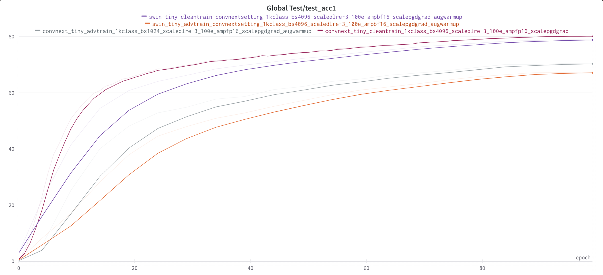
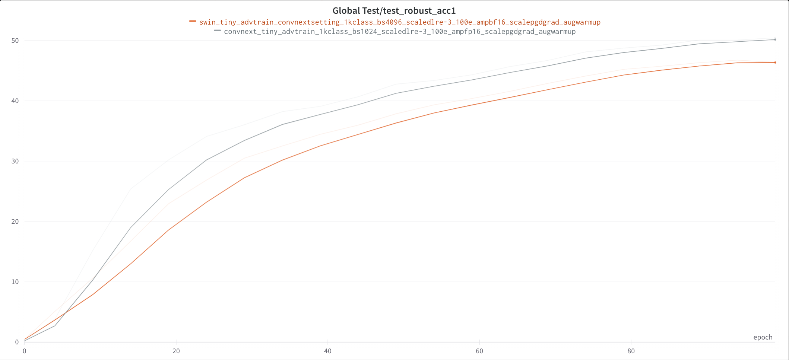

# Adversarial Robustness of SOTA Vision Transformers vs. CNNs

## Outline

1. [Introduction and Motivation](#introduction-and-motivation)
2. [Adversarial Training Details and Tricks](#adversarial-training-details-and-tricks)
3. [Adversarial Robustness Comparison on the ImageNet](#adversarial-robustness-comparison-on-the-imagenet)
4. [Concluding Remarks](#concluding-remarks)
5. [Citation](#citation)
6. [References](#references)

## Introduction and Motivation
There is a recent trend of unifying methodologies for different deep learning tasks: vision, natural language processing, speech... etc. Transformers have been introduced into the field of computer vision and become a strong competitor for Convolutional Neural Networks (CNNs). With the performance of vision transformers being on-par or even better than that of CNNs, several previous works [[2]](#bai2021transformers)[[4]](#shao2021adversarial)[[5]](#aldahdooh2021reveal)[[6]](#benz2021adversarial) look into the adversarial robustness comparison of vision transformers vs. CNNs. However, most of them compare models with different:

* **model size**
* **pretrain dataset**
* **macro and micro architectural design**
* **training recipe**

Some of them directly test the adversarial robustness on the clean trained model, whose robustness accuracy quickly drops to 0. A few others compare defended models after adversarial training, but those models have quite different clean accuracy to start with. All of these make it unclear if transformer type models are better than CNN type models in terms of adversarial robustness. 

Our main goal with this study is to provide a fair comparision of the adversarial robustness of some relatively recent vision transformers (PoolFormer, Swin Transformer, DeiT) and CNNs (ConvNext, ResNet50). This comparison can give us insight into the adversarially robustness implication of two model types. To ensure fairness of comparison, we try to align:
 * **model size**: we select model variants with similar # of parameters
 * **dataset**: all models adversarially trained on ImageNet-1k from scratch
 * **macro and micro architectural design**: ConvNext is designed to strictly follow Swin Transformer's macro and micro architectures.
 * **training recipe**: We fully align training recipe for Swin Transformer and ConvNext. All other models also use training recipe close to ConvNext.

For all models we compare, we first apply the same adversarial training with PGD on the ImageNet dataset without any pretraining and then test robustness performance of the adversarially trained models. For better comparison of models that start with different clean accuracy, we calculate the relative drop of top@1 robust accuracy with respect to top@1 clean accuracy.

## Adversarial Training Details and Tricks

We adversarially train all models on the ImageNet-1k dataset from scratch. We first apply the PGD-1 attacker (eps=4/255, step=4/255) with random restart on the training set and then evaluate the robustness with the PGD-5 attacker ((eps=4/255, step=1/255)) with random restart on the validation set. 

Adversarial training on the ImageNet takes a long time and often causes Out of Memory (OOM) error on our machines. We tried to lower the global batch size, which resulted in suboptimal training. To resolve the issue, we apply distributed mixed precision training, which greatly reduce the training time and GPU memory consumption. The difference in acc@1 for mixed precision training and full precision training is negligible (<1%). For distributed training, we apply the "learning rate scaling" technique mentioned in [[3]](#goyal2017accurate). For the half precision data type, we exprimented with both IEEE's `float16` and Google Brain's `bfloat16`, which have similar clean and robust acc@1 after training. Although `bfloat16` is slower than `float16`, we chose `bfloat16` since `float16` will sometimes results in training crash for some models. 

Adversarial training on the ImageNet turned out to be very sensitive to training hyperparameters, so we spent quite some time to obtain the best trainig results for each model. For all models except for ResNet50, we apply the "data augmentation warmup" mentioned in [[2]](#bai2021transformers) to gradually increase the augmentation strength for stable training. 

For fair comparison, we fully align the trianing recipe for ConvNext and Swin Transformer. For all other models, we closely follow the trainig recipe as the original paper, which all turn out to be very close to ConvNext's training recipe except for ResNet50. For all models, we select the variant with similar model size in terms of the total number of parameters.


| **model**                 |    **convnext-tiny**    |      **swin-tiny**      |    **poolformer-s36**   |      **deit-small**     |   **resnet50-gelu***  |
|---------------------------|:-----------------------:|:-----------------------:|:-----------------------:|:-----------------------:|:---------------------:|
| **activation**            |           gelu          |           gelu          |           gelu          |           gelu          |          gelu         |
| **norm layer**            |            ln           |            ln           |        groupnorm        |            ln           |           bn          |
| **epochs**                |           300           |           300           |           300           |           100           |          100          |
| **batch size**            |           4096          |           4096          |           4096          |           4096          |          512          |
| **optimizer**             |          AdamW          |          AdamW          |          AdamW          |          AdamW          |      SGD, mom=0.9     |
| **init lr (bs1024)**      |         1.00E-03        |         1.00E-03        |         1.00E-03        |         1.00E-03        |          0.4          |
| **lr decay (bs1024)**     |   cosine, minlr=2.5e-7  |   cosine, minlr=2.5e-7  |   cosine, minlr=2.5e-7  |    cosine, minlr=e-5    |   step30e, minlr=e-5  |
| **warmup**                |   initlr=0, 10e linear  |   initlr=0, 10e linear  |   initlr=0, 5e linear   | initlr=1e-6, 10e linear | initlr=0.1, 5e linear |
| **amp**                   |           bf16          |           bf16          |           bf16          |           bf16          |           no          |
| **weight decay**          |           0.05          |           0.05          |           0.05          |           0.05          |        1.00E-04       |
| **label smoothing eps**   |           0.1           |           0.1           |           0.1           |           0.1           |          0.1          |
| **dropout**               |            no           |            no           |            no           |            no           |           no          |
| **stochastic depth rate** |           0.1           |           0.1           |           0.2           |            0            |           0           |
| **repeated aug**          |            no           |            no           |            no           |            no           |           no          |
| **gradient clip**         |            no           |            no           |            no           |            no           |           no          |
| **EMA**                   |            no           |            no           |            no           |            no           |           no          |
| **rand aug**              | m1-mstd0.5-->m9-mstd0.5 | m1-mstd0.5-->m9-mstd0.5 | m1-mstd0.5-->m9-mstd0.5 | m1-mstd0.5-->m9-mstd0.5 |  rand-m9-mstd0.5-inc1 |
| **mixup alpha**           |           0.8           |           0.8           |           0.8           |           0.8           |           0           |
| **cutmix alpha**          |      0-1.0 at 6th e     |      0-1.0 at 6th e     |      0-1.0 at 6th e     |      0-1.0 at 6th e     |           0           |
| **mixup/cutmix prob**     |     0.5-1 first 0-5e    |     0.5-1 first 0-5e    |     0.5-1 first 0-5e    |     0.5-1 first 0-5e    |           1           |
| **rand erasing prob**     |            0            |            0            |            0            |            0            |           0           |


## Adversarial Robustness Comparison on the ImageNet

Swin transformer emerges recently as one of the new SOTA vision transformer backbones. It adds heiarchical feature map and local self attention with window shift compared with the DeiT model. ConvNext follows Swin's macro and micro architectural design closely, making it a good candidate for robustness comparison. If one model is noticably more robust than the other, it will give us insight into if the attention operation is superior to the convolution operation in terms of adversarial robustness. As shown by our results, after aligning the adversarial training recipe, they have very close robustness performance. We also experiment with the recently introduced PoolFormer model, which replace self attention operation with a simple average pooling while keeping the the same "MetaFormer" [[1]](#yu2022metaformer) macro design as vision transformers. PoolFormer also has similar robustness after adversarialy training. 

For ResNet50-GELU and DeiT-small, we use results reported in the paper [[2]](#bai2021transformers). These are model adversarially trained with full precison. We also perform `bf16` mixed precision training on the DeiT model and results in very close performance. As shown in the table, they have the same robustness in terms of relative drop from clean acc@1 to robust acc@1. The relative drop rate for ResNet50 and DeiT are lower than the more recent models. We think this is likely due to the difference in model size. It is known in the literature that advesarial training requires larger model capacity. Model with larger capacity can be adversarially trained better and thus have slightly higher relative drop ratio.

### Robustnes Results on ImageNet1k

| **Model**      | **Train Prec** | **Num Para** | **Clean Acc@1** | **PGD-5 Acc@1** | **Relative Drop** |
|----------------|:-------:|:----------:|:---------------:|:---------------:|:-------------------:|
| convnext-tiny  |   bf16  |     29M    |      69.98%     |      49.95%     |         -29%        |
| swin-tiny      |   bf16  |     28M    |      67.24%     |      46.66%     |         -31%        |
| poolformer-s36 |   bf16  |    30.8M   |      66.32%     |      44.80%     |         -32%        |
| deit-small     |   bf16  |     22M    |      66.48%     |      44.60%     |         -33%        |
| deit-small*    |    full   |     22M    |      66.50%     |      43.95%     |         -34%        |
| resnet50-gelu* |    full   |     25M    |      67.38%     |      44.01%     |         -35%        |

model* denotes model results reported in the previous work.

### Training and Validation Learning Curves




## Concluding Remarks

This study provides a fair comparsion of the advesarial robustness of some recent vision transformers and CNNs. We summarize out findings below:

1. vision transformers are as adversarially robust as CNNs after aligning model size, pretrain dataset, macro and micro architectural design, and training recipe.
2. as far as the basic network operation, self-attention is as robust as convolution.
3. for fair evaluation of adversarial robustness, we should first apply basic advesarial training and then compare robustness of different models. Relative drop rate is a better and more intuitive metric than absolute robust accuracy.
4. adversarial training is very sensitive. Lots of factors such as model size, number of epochs, initial learning rate... etc, can influnce the training outcome. Careful training and evuation procedures should be followed for fair robustness comparison. 

We hope this can provide some useful insight to researchers and practitioners in the field of adversarial machine learning and deep learning architecture.

## Citation
If you find this study helpful, please consider citing:
```

@unpublished{xu2022AdvTransCNNs,
  author = {Ke Xu and Ram Nevatia},
  title  = {Adversarial Robustness of SOTA Vision Transformers vs. CNNs},
  month  = "May",
  year   = {2022},
}
```

## References

<a name="yu2022metaformer">[1] Yu, W., Luo, M., Zhou, P., Si, C., Zhou, Y., Wang, X., ... & Yan, S. (2022). Metaformer is actually what you need for vision. In Proceedings of the IEEE/CVF Conference on Computer Vision and Pattern Recognition (pp. 10819-10829).</a>

<a name="bai2021transformers"> [2] Bai, Y., Mei, J., Yuille, A. L., & Xie, C. (2021). Are Transformers more robust than CNNs?. Advances in Neural Information Processing Systems, 34, 26831-26843.</a>

<a name="goyal2017accurate">[3] Goyal, P., Dollár, P., Girshick, R., Noordhuis, P., Wesolowski, L., Kyrola, A., ... & He, K. (2017). Accurate, large minibatch sgd: Training imagenet in 1 hour. arXiv preprint arXiv:1706.02677.</a>

<a name="shao2021adversarial">[4] Shao, R., Shi, Z., Yi, J., Chen, P. Y., & Hsieh, C. J. (2021). On the adversarial robustness of vision transformers. arXiv preprint arXiv:2103.15670.</a>

<a name="aldahdooh2021reveal">[5] Aldahdooh, A., Hamidouche, W., & Deforges, O. (2021). Reveal of vision transformers robustness against adversarial attacks. arXiv preprint arXiv:2106.03734.</a>

<a name="benz2021adversarial">[6] Benz, P., Ham, S., Zhang, C., Karjauv, A., & Kweon, I. S. (2021). Adversarial robustness comparison of vision transformer and mlp-mixer to cnns. arXiv preprint arXiv:2110.02797.</a>
